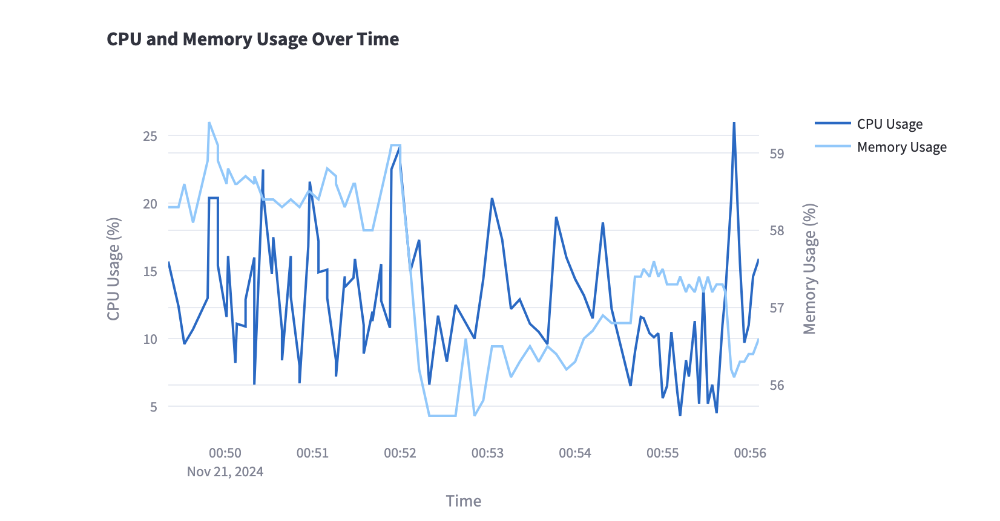

# System Monitor Dashboard

This project provides a real-time system monitoring dashboard that visualizes various performance metrics of your macOS system using Streamlit and Plotly. It collects data on CPU usage, memory usage, disk usage, and network activity, then presents them in an interactive web interface.

## Features

- Real-time monitoring of:
 * Virtual memory composition over time (serial graph) 
 * Virtual memory usage vs Swap memory usage over time (serial graph)
 * CPU usage percentage vs. Memory usage percentage (serial graph)
 * Network usage over time (incoming and outgoing traffic)

## Technologies Used

- Python
- Streamlit: For creating the web application interface
- Plotly: For generating interactive charts
- Pandas: For data manipulation and analysis
- psutil: For retrieving system and process utilities information
- SQLite: For local data storage

## Project Structure

```
.
├── src/
│   ├── __init__.py
│   ├── data/
│   │   ├── __init__.py
│   │   ├── collector.py       # Data collection module
│   │   └── storage.py         # Data storage and loading module
│   │
│   ├── visualization/
│   │   ├── __init__.py
│   │   └── charts.py          # Plotly chart generation module
│   │
│   └── app/
│       ├── __init__.py
│       └── main.py            # Streamlit application main file
│
├── tests/
│   ├── __init__.py
│   ├── test_collector.py
│   └── test_storage.py
│
├── data/
│   ├── system_monitor.db      # SQLite database file
│   └── logs/                  # Log files directory
│
├── config/
│   └── settings.py            # Configuration file
│
├── requirements.txt           # Dependency package list
├── README.md                  # Project documentation
├── .gitignore                 # Git ignore file configuration
└── run.sh                     # Execution script
```

## Installation

1. Clone the repository:
  ```bash
  git clone https://github.com/jeans-all/OS_Monitoring.git
  cd OS_Monitoring
  ```

2. Create a virtual environment and activate it:
  ```bash
  python -m venv my_env
  source venv/bin/activate 
  ```

3. Install dependencies:
  ```bash
  pip install -r requirements.txt
  ```

## Usage

Run the application using the provided script:
```bash
./run.sh
```

Or manually start the Streamlit application:
```bash
streamlit run src/app/main.py
```

Open your web browser and navigate to `http://localhost:8501` to view the dashboard.

## Test

python3 -m unittest discover tests


## Play Screen





